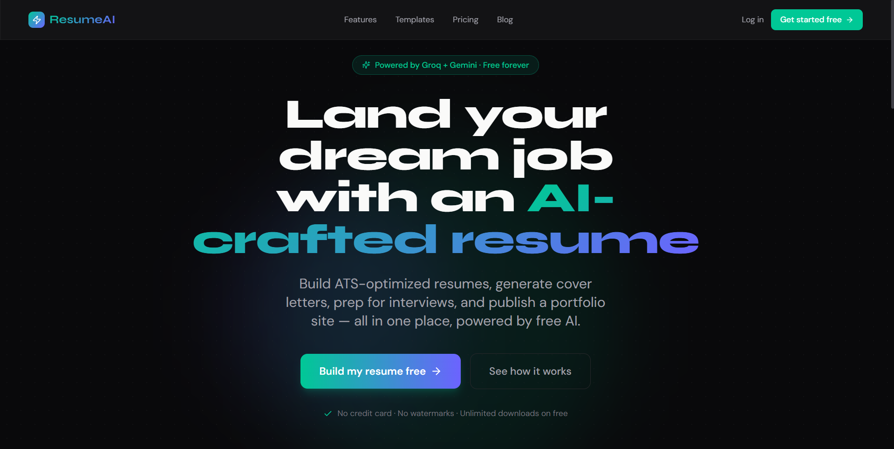
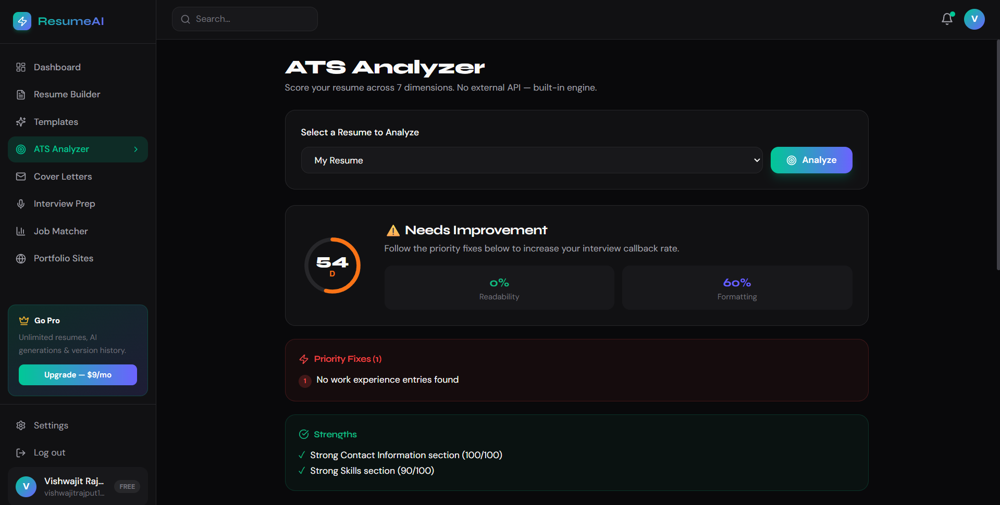
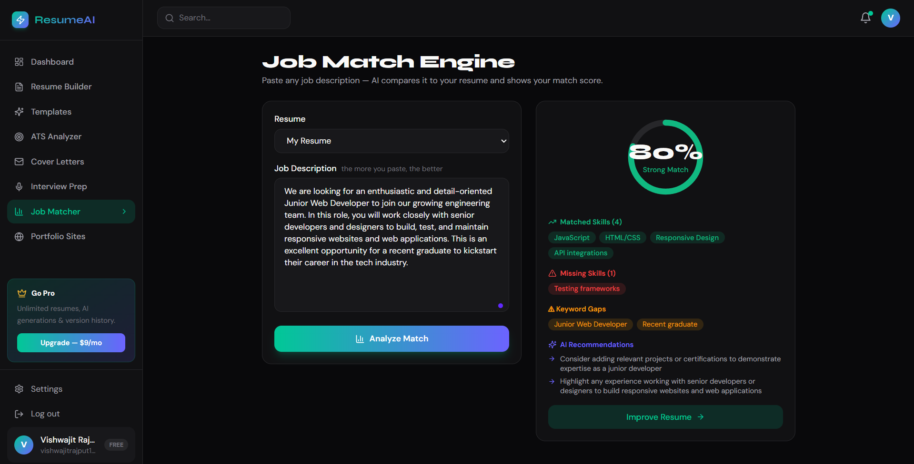
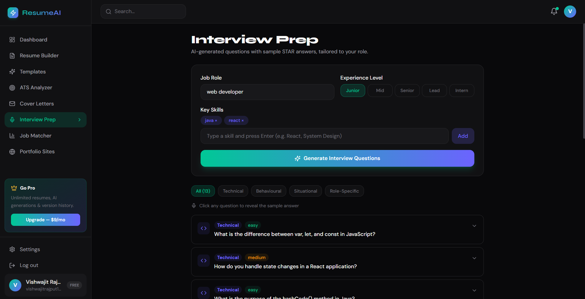
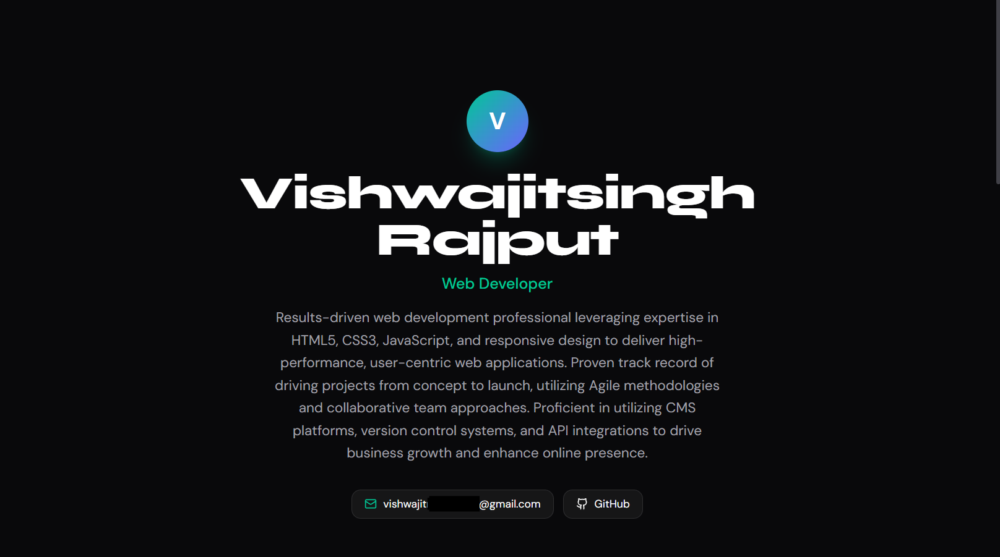

<div align="center">


# 📄 ResumeForge

### *Your career. Every tool. One AI-powered platform.*

> The unified career platform that builds ATS-optimized resumes, generates cover letters,
> matches job descriptions, and publishes portfolio websites — all powered by **free AI** (Groq + Gemini).

<br/>

[](https://resumeforge.vercel.app)


</div>

<br/>

---

## 🚀 Live Demo

<div align="center">

### [**https://resumeforge.vercel.app**](https://resumeforge.vercel.app)



*No sign-up required — use the demo account below to explore every feature instantly.*

</div>

<br/>

| Field | Value |
|:---|:---|
| 📧 **Demo Email** | `demo@resumeforge.ai` |
| 🔑 **Demo Password** | `Demo@ResumeForge2024!` |

> The demo account is pre-seeded with resumes, cover letters, ATS reports, and portfolio data — everything populated and ready to explore.

---

## 📌 Problem Statement

Job seekers today are overwhelmed by **fragmented career tools** scattered across multiple platforms:

| Pain Point | Problem |
|:---|:---|
| 📄 Generic resume templates | No ATS optimisation; rejected before a human ever reads them |
| 📝 Cover letter writing | Time-consuming to personalise for every application |
| 🎯 Job description matching | No objective signal on how well a resume fits a role |
| 🌐 Portfolio presence | Requires coding knowledge or costly website builders |
| 🤖 Interview preparation | No tailored question bank based on the actual role |

**The consequence:** Qualified candidates are eliminated by automated ATS filters, spend hours on manual tailoring, and miss opportunities simply due to poor presentation — not lack of skill.

---

## 📸 Screenshots

<div align="center">

| | |
|:---:|:---:|
|  |  |
| **10-Step Resume Builder** | **ATS Score Engine** |
|  |  |
| **AI Cover Letter Generator** | **Job Match Engine** |
|  |  |
| **Interview Question Generator** | **Analytics Dashboard** |
|  |  |
| **1-Click Portfolio Website** | **Landing Page** |

</div>

---

## 💡 Solution

ResumeForge is a **unified AI career platform** that generates, scores, and tailors every career document a job seeker needs — from the first resume draft to a live portfolio website — powered entirely by free AI APIs.

**The core innovation** is a dual-AI pipeline (Groq for speed, Gemini for quality, with automatic fallback) that powers seven distinct career tools through a single account — with a custom 7-dimension ATS scoring engine that runs entirely on-device with zero API cost.

---

## 🛠️ Tech Stack

### 🖥️ Frontend

| Technology | Version | Purpose |
|:---|:---:|:---|
|  **Next.js** | 15 | React framework — App Router, SSR, file-based routing |
|  **React** | 19 | UI rendering |
|  **TypeScript** | 5 | Full type safety across the codebase |
|  **Tailwind CSS** | 3.4 | Utility-first styling |
|  **Framer Motion** | 11 | Animations and page transitions |
| **Zustand** | 4.5 | Lightweight global state (auth + resume) |
| **React Hook Form** + **Zod** | — | Form handling and schema validation |
| **TanStack Query** | 5 | Server state, caching, and background refetching |
| **Recharts** | 2.x | ATS radar charts and analytics visualisations |
| **Axios** | 1.7 | HTTP client with token-refresh interceptor |

### ⚙️ Backend

| Technology | Version | Purpose |
|:---|:---:|:---|
|  **Node.js** | ≥ 20 | Server runtime |
|  **Express** | 4.19 | REST API framework — 8 route modules |
| **TypeScript** | 5 | End-to-end type safety |
| **Multer + Cloudinary Storage** | — | File upload pipeline (profile photos, attachments) |
| **Nodemailer** | 6.9 | Email delivery for export links |
| **bcryptjs** | 2.4 | Password hashing (12 rounds) |
| **jsonwebtoken** | 9.0 | JWT access (15 min) + refresh tokens (7 days) |
| **Helmet** + **HPP** + **rate-limit** | — | Security headers, parameter pollution, rate gating |
| **Winston** | 3.x | Structured HTTP + error logging |

### 🗄️ Database & Storage

| Technology | Purpose |
|:---|:---|
|  **MongoDB Atlas** | Primary datastore — 5 Mongoose schemas (users, resumes, cover letters, portfolios, sessions) |
| **Mongoose** | ODM — schema validation, virtuals, and query helpers |
|  **Cloudinary CDN** | Profile photo and exported file storage with global edge delivery |

### 🤖 AI & Integrations

| Service | Model | Purpose |
|:---|:---|:---|
|  **Groq** | `llama-3.3-70b-versatile` | AI summary, bullet improvements, cover letters, job match, interview questions |
|  **Google Gemini** | `gemini-1.5-flash` | Quality fallback — used when Groq quota is exhausted |
| **Custom ATS Engine** | — | 7-dimension scoring (keywords, formatting, sections, readability…) — runs locally, zero API cost |
| **Puppeteer / html-pdf** | — | Server-side PDF and DOCX export from resume data |
| **Google OAuth 2.0** | — | One-click social sign-in |

### ☁️ DevOps & Deployment

| Service | Purpose |
|:---|:---|
|  **Vercel** | Frontend hosting — automatic CI/CD on every push |
|  **Render** | Backend hosting — Node runtime, free web service |
| **GitHub Actions** | CI/CD pipeline — lint, test, build, deploy on every PR merge |

---

## ⚙️ Features

### 🔵 Resume Builder


- **10-step guided wizard** — Personal Info → Work Experience → Education → Skills → Projects → Certifications → Languages → Interests → Summary → Review
- **Live preview panel** — see the formatted resume update in real time as you type
- **4 ATS-friendly templates** — Classic, Modern, Minimal, Executive — all fully machine-readable
- **AI Summary Generator** — one-click professional summary from your raw experience data
- **AI Bullet Improver** — paste a weak bullet, get a strong, metrics-driven rewrite instantly
- **Auto-save** — resume state persisted to MongoDB on every change, no manual saving needed
- **Version History** *(Pro)* — restore any previous snapshot of your resume

### 🟢 ATS Score Engine

|  |  |
|:---:|:---:|
| **ATS Score Report** | **Job Match Analysis** |

- **7-dimension ATS scoring** — Keywords · Formatting · Section Completeness · Readability · Quantified Achievements · Contact Info · File Compatibility
- **Per-dimension breakdown** — colour-coded radar chart with actionable fix suggestions for every weak dimension
- **Job Match Engine** — paste any job description; AI computes a match score, highlights missing keywords, and suggests targeted rewrites
- **Zero API cost** — ATS engine runs entirely in the backend with no external calls

### 🟡 AI Writing Tools

|  |  |
|:---:|:---:|
| **Cover Letter Generator** | **Interview Question Generator** |

- **Cover Letter Generator** — AI drafts a fully personalised letter from your resume + job description in seconds; saved per application
- **Interview Question Generator** — role-aware MCQ and behavioural question bank with model answers; 5 sessions free, unlimited on Pro
- **AI provider toggle** — switch between Groq (speed) and Gemini (quality) with a single env variable, or run `GROQ_FALLBACK` mode for automatic failover

### 🔴 Portfolio Website


- **1-Click generation** — pulls your resume data and publishes a live portfolio at `resumeforge.app/portfolio/[username]`
- **Public shareable URL** — send to recruiters as a living document that always reflects your latest resume
- **Custom sections** — projects, skills, and experience rendered as interactive cards

### 🟠 Export & Analytics

|  |  |
|:---:|:---:|
| **Analytics Dashboard** | **User Profile** |

- **PDF & DOCX export** — server-rendered, pixel-perfect output matching the live preview template
- **Application tracker** — log every role you applied to, status (applied / interview / offer / rejected), and notes
- **Analytics dashboard** — ATS score history, application funnel, weekly activity, improvement trends over time

### ⚪ Infrastructure & UX

- **Dark / Light theme** — Zustand-persisted smooth toggle across sessions
- **Freemium plan gating** — free / pro tiers enforced via `freemium.ts` middleware on every restricted route
- **Demo mode** — pre-seeded account with resumes, cover letters, and ATS reports ready to inspect instantly
- **Self-keepalive cron** — pings Render backend every 14 minutes to eliminate free-tier cold starts
- **Google OAuth** — social sign-in alongside email/password auth

---

## 🧩 System Architecture

```
┌─────────────────────────────────────────┐
│         CLIENT  ·  Browser              │
│   Next.js 15 · React 19 · Zustand       │
└────────┬──────────────────────┬─────────┘
         │ REST (Axios)         │ OAuth
         ▼                      ▼
┌─────────────────────────────────────────┐
│     API SERVER · Express + Node.js      │
│                                         │
│  Route Modules (8)                      │
│  /auth  /resume  /ai  /ats              │
│  /cover-letter  /portfolio              │
│  /export  /admin                        │
│                                         │
│  aiProvider    (Groq + Gemini fallback) │
│  atsEngine     (custom, no API)         │
│  exportService (PDF + DOCX)             │
│  freemiumMw    (plan enforcement)       │
└──┬──────┬──────┬──────┬────────────────┘
   ▼      ▼      ▼      ▼
MongoDB  Cloud-  Groq  Gemini
Atlas    inary   LLaMA Flash
         CDN     3.3   1.5
                   │
            Google OAuth 2.0
```

### Data Flow — AI Resume Generation

```
User fills wizard step  ──or──  pastes job description
              │
              ▼
┌─────────────────────────────────────────┐
│              aiProvider                 │
│                                         │
│  1. Try Groq  (llama-3.3-70b)          │
│     → on quota error →                  │
│  2. Fallback Gemini (gemini-1.5-flash)  │
└──────────────┬──────────────────────────┘
               │  generated text
               ▼
┌─────────────────────────────────────────┐
│             atsEngine                   │
│  1. Tokenise resume sections            │
│  2. Score 7 dimensions (local)          │
│  3. Return radar data + suggestions     │
└──────┬──────────────────────────────────┘
       ▼
  MongoDB Atlas          exportService
  Resume document  →     Puppeteer → PDF
  + ATS snapshot         html-docx  → DOCX
```

---

## 📂 Project Structure

```
resumeforge/
├── .github/workflows/ci-cd.yml    # GitHub Actions — lint, test, deploy
├── .env.example                    # Environment template
├── backend/
│   └── src/
│       ├── index.ts                # Express server entry
│       ├── config/
│       │   ├── ai-config.ts        # AI provider config + system prompts
│       │   └── database.ts         # MongoDB Atlas connection
│       ├── models/
│       │   ├── User.ts             # User schema + plan limits
│       │   ├── Resume.ts           # Resume schema (10 sections)
│       │   ├── CoverLetter.ts      # Cover letter + application link
│       │   ├── Portfolio.ts        # Portfolio config + published URL
│       │   └── StudySession.ts     # Analytics event log
│       ├── routes/
│       │   ├── auth.ts             # Register, login, Google OAuth, refresh
│       │   ├── resume.ts           # CRUD + auto-save
│       │   ├── ai.ts               # All AI generation endpoints
│       │   ├── ats.ts              # ATS scoring (local engine)
│       │   ├── portfolio.ts        # Portfolio publish + public page data
│       │   ├── cover-letter.ts     # Cover letter save + list
│       │   ├── export.ts           # PDF / DOCX export
│       │   └── admin.ts            # Admin panel APIs
│       ├── services/
│       │   ├── ai-provider.ts      # Groq + Gemini with fallback logic
│       │   ├── ats-engine.ts       # Custom 7-dimension ATS scorer
│       │   └── export-service.ts   # Puppeteer PDF + html-docx renderer
│       └── middleware/
│           ├── auth.ts             # JWT protect middleware
│           └── freemium.ts         # Plan limit enforcement
└── frontend/
    ├── app/
    │   ├── page.tsx                # Landing page
    │   ├── dashboard/              # Main dashboard
    │   ├── resume/builder/         # 10-step resume wizard
    │   ├── ats/                    # ATS analyser + radar chart
    │   ├── cover-letter/           # Cover letter generator
    │   ├── interview-prep/         # AI interview question bank
    │   ├── job-match/              # Job description matcher
    │   └── portfolio/[username]/   # Public portfolio page
    ├── components/
    │   ├── layout/Sidebar.tsx      # Navigation sidebar
    │   ├── resume/
    │   │   ├── builder/steps/      # 10 wizard step components
    │   │   ├── builder/LivePreview.tsx
    │   │   └── templates/          # 4 ATS-friendly templates
    │   └── providers/              # React Query + auth providers
    ├── store/
    │   ├── auth-store.ts           # Zustand auth state
    │   └── resume-store.ts         # Resume builder state
    └── lib/
        └── api-client.ts           # Axios + token-refresh interceptor
```

---

## 🧪 Running Locally

### Prerequisites

| Tool | Minimum Version |
|:---|:---:|
| Node.js | 20.0.0 |
| npm | 9.0.0 |
| MongoDB Atlas | Free M0 cluster |
| Groq API Key | Free — [console.groq.com](https://console.groq.com) |
| Gemini API Key | Free — [aistudio.google.com](https://aistudio.google.com) |

### Installation

```bash
# Clone the repository
git clone https://github.com/yourusername/resumeforge.git
cd resumeforge

# Install backend dependencies
cd backend && npm install

# Install frontend dependencies
cd ../frontend && npm install
```

### Configuration

```bash
# Backend
cp .env.example backend/.env

# Frontend
cp .env.example frontend/.env.local
```

Fill in all values as described in the [Environment Variables](#-environment-variables) section below.

### Get Your Free API Keys

**Groq (Recommended — fastest)**
1. Go to [console.groq.com](https://console.groq.com)
2. Sign up free — no credit card required
3. Create an API key
4. Add to `backend/.env`: `GROQ_API_KEY=gsk_...`

**Gemini (Best quality)**
1. Go to [aistudio.google.com](https://aistudio.google.com)
2. Click *Get API Key* → Create in new project
3. Add to `backend/.env`: `GEMINI_API_KEY=AIza...`

### Start

```bash
# Terminal 1 — API Server  →  http://localhost:5000
cd backend && npm run dev

# Terminal 2 — Frontend    →  http://localhost:3000
cd frontend && npm run dev
```

Open [http://localhost:3000](http://localhost:3000)

### Seed Demo Data *(optional)*

```bash
cd backend && node scripts/seedDemo.js
```

---

## 🔐 Environment Variables

### Backend — `backend/.env`

| Variable | Required | Description |
|:---|:---:|:---|
| `MONGODB_URI` | ✅ | MongoDB Atlas connection string |
| `JWT_ACCESS_SECRET` | ✅ | 64-char random string for access token signing |
| `JWT_REFRESH_SECRET` | ✅ | Different 64-char random string for refresh tokens |
| `GROQ_API_KEY` | ✅ | Groq API key — powers all AI features ([groq.com](https://groq.com)) |
| `GEMINI_API_KEY` | ✅ | Google Gemini — quality fallback ([ai.google.dev](https://ai.google.dev)) |
| `AI_PROVIDER` | ✅ | `GROQ` · `GEMINI` · `GROQ_FALLBACK` (recommended) |
| `CLOUDINARY_CLOUD_NAME` | ✅ | Cloudinary cloud name |
| `CLOUDINARY_API_KEY` | ✅ | Cloudinary API key |
| `CLOUDINARY_API_SECRET` | ✅ | Cloudinary API secret |
| `GOOGLE_CLIENT_ID` | ⚙️ | Google OAuth client ID — required for social sign-in |
| `GOOGLE_CLIENT_SECRET` | ⚙️ | Google OAuth client secret |
| `EMAIL_USER` | ⚙️ | Gmail address for export link emails |
| `EMAIL_PASS` | ⚙️ | Gmail App Password (not your account password) |
| `BACKEND_URL` | ⚙️ | Deployed backend URL — activates self-keepalive cron |
| `FRONTEND_URL` | ⚙️ | Deployed frontend URL |
| `NODE_ENV` | — | `development` or `production` |
| `PORT` | — | Server port (default: `5000`) |
| `DEMO_EMAIL` | ➕ | Demo account email |
| `DEMO_PASSWORD` | ➕ | Demo account password |

### Frontend — `frontend/.env.local`

| Variable | Required | Description |
|:---|:---:|:---|
| `NEXT_PUBLIC_API_URL` | ✅ | Backend API base URL e.g. `http://localhost:5000/api` |
| `NEXT_PUBLIC_GOOGLE_CLIENT_ID` | ⚙️ | Google OAuth client ID for frontend sign-in button |

---

## 📸 User Journey

| Step | Action |
|:---:|:---|
| 1️⃣ **LAND** | Homepage → animated feature showcase → sign up in 30 seconds |
| 2️⃣ **BUILD** | Launch 10-step wizard → fill sections with live preview updating in real time |
| 3️⃣ **IMPROVE** | AI rewrites your summary and bullets into impactful, metrics-driven language |
| 4️⃣ **SCORE** | ATS engine rates your resume across 7 dimensions → fix suggestions per dimension |
| 5️⃣ **MATCH** | Paste a job description → AI scores fit, highlights gaps, suggests keyword inserts |
| 6️⃣ **WRITE** | AI drafts a personalised cover letter in seconds → saved per application |
| 7️⃣ **PREP** | Generate role-specific interview questions with model answers → practice before the call |
| 8️⃣ **PUBLISH** | One click → live portfolio page at `resumeforge.app/portfolio/[username]` |
| 9️⃣ **EXPORT** | Download ATS-ready PDF or DOCX — server-rendered, pixel-perfect |
| 🔟 **TRACK** | Log every application → analytics dashboard shows your funnel and ATS score trends |

### Dashboard Tabs

| Category | Tabs |
|:---|:---|
| 📄 **Resume** | `BUILDER` · `MY_RESUMES` · `TEMPLATES` · `VERSION_HISTORY` |
| 🎯 **Analysis** | `ATS_SCORE` · `JOB_MATCH` |
| 🤖 **AI Tools** | `COVER_LETTER` · `INTERVIEW_PREP` · `BULLET_IMPROVER` · `SUMMARY_GEN` |
| 🌐 **Portfolio** | `PORTFOLIO` · `PUBLIC_PAGE` |
| 📊 **Tracking** | `APPLICATIONS` · `ANALYTICS` |
| 👤 **Account** | `PROFILE` · `PLAN` |

---

## 🌍 Scalability & Future Scope

### Why the Current Architecture Scales

| Layer | Scaling Property |
|:---|:---|
| **MongoDB Atlas** | Horizontal sharding-ready; TTL indexes for session cleanup |
| **Cloudinary CDN** | Global edge delivery — no platform storage ceiling |
| **Express API** | Stateless — horizontally scalable behind any load balancer |
| **Groq + Gemini dual AI** | Failover between two providers eliminates single-point-of-failure on AI |
| **Custom ATS Engine** | Runs in-process — zero external latency, zero API cost at any scale |

### Roadmap

| Priority | Feature |
|:---:|:---|
| 🔜 | LinkedIn profile import — auto-populate all wizard steps from LinkedIn URL |
| 🔜 | Chrome extension — apply to jobs with one click, auto-tailoring resume per listing |
| 🔜 | Native mobile app (React Native) — zero backend changes required |
| 🔄 | Real-time collaborative resume editing (CRDT-based) |
| 🔄 | Multi-language resume support — translate resume content into target-country language |
| 🔄 | AI salary range estimator from job description + location |
| 🔮 | ATS system simulation — replicate specific ATS parsers (Workday, Greenhouse, Lever) |
| 🔮 | Video intro generator — AI scripts a 60-second recruiter pitch from resume data |
| 🔮 | Recruiter marketplace — opt-in to let verified recruiters search your anonymised profile |

---

## 💰 Business Potential

### Monetization

| Tier | Price | Highlights |
|:---|:---:|:---|
| **Free** | $0 / mo | 3 resumes, 20 AI uses/mo, 1 portfolio, 3 cover letters, all templates |
| **Pro** | $5 / mo | Unlimited everything, version history, advanced analytics, priority AI |
| **Team** | $15 / mo | Shared workspace, bulk export, recruiter dashboard, SSO |

### Target Market

| Segment | Scale |
|:---|:---|
| 🎓 University students & new graduates | ≈ 200 million entering the workforce annually |
| 💼 Active job seekers across all industries | 1.5 billion working-age adults globally in career transition |
| 🏢 University career centres & bootcamps | Institutional licensing — tools for their entire cohort |
| 🌏 Non-English-speaking markets | AI translation opens SEA, MENA, and LATAM markets with localised resume formats |

### Market Relevance

The global HR tech market is valued at **$40B+**, with AI-powered resume tools growing at **≈22% CAGR**. ResumeForge sits at the intersection of career productivity and generative AI — two of the fastest-growing software categories. The free-AI-first architecture (Groq + Gemini) means zero marginal AI cost per user, making the unit economics dramatically better than incumbents paying OpenAI rates. The portfolio and job-match features create a sticky, end-to-end career loop that drives retention far beyond a simple resume editor.

---

## 🏆 Hackathon Edge

| Differentiator | Why It Matters |
|:---|:---|
| **Zero-cost AI stack** | Groq (14,400 req/day free) + Gemini (1M tokens/day free) with automatic failover — production-grade AI at $0/month. |
| **Custom 7-dimension ATS engine** | No external API, no per-call cost — runs locally and produces richer feedback than any paid ATS checker on the market. |
| **Dual-provider AI fallback** | Single env variable switches between Groq, Gemini, or auto-fallback — never a failed generation due to quota exhaustion. |
| **10-step wizard + live preview** | Not a form — a guided experience with a rendered resume updating at every keystroke. Judges can feel the product quality immediately. |
| **1-click portfolio publish** | Turns a resume into a live, public, shareable URL instantly — a feature that typically requires an entire separate product. |
| **Production-deployed, not a prototype** | Live on Vercel + Render with real auth, real data, and a seeded demo — judges can use it right now, not after a 5-minute setup. |
| **End-to-end career loop** | Build → Score → Match → Write → Prep → Publish → Export → Track — all inside one account. No other free tool covers the full lifecycle. |
| **Export quality** | Server-rendered PDF and DOCX via Puppeteer — pixel-perfect output that matches the live preview, not a browser print hack. |

---

## 🤝 Contributing

Contributions are welcome. Here is how to get started:

```bash
# 1. Fork and clone
git clone https://github.com/yourusername/resumeforge.git
cd resumeforge

# 2. Create a feature branch
git checkout -b feature/your-feature-name

# 3. Commit your changes
git add .
git commit -m "feat: describe your change clearly"

# 4. Push and open a Pull Request
git push origin feature/your-feature-name
```

**Good first issues:** additional resume templates · spaced-repetition interview flashcards · Redis adapter for session clustering · mobile responsiveness improvements · LinkedIn import parser · ATS engine additional dimensions.

Please follow the existing code style, comment non-obvious logic, and test locally before submitting.

---

## 👨‍💻 Author

<div align="center">

### Your Name

*Full-Stack Developer · Computer Engineer*

Your College / University

<br/>

[](https://github.com/yourusername)
[](https://instagram.com/yourhandle)
[](https://linkedin.com/in/yourprofile)

</div>

---

<div align="center">

*Built with precision and passion — for every job seeker who deserves smarter tools.*

<br/>

[](https://resumeforge.vercel.app)

</div>
